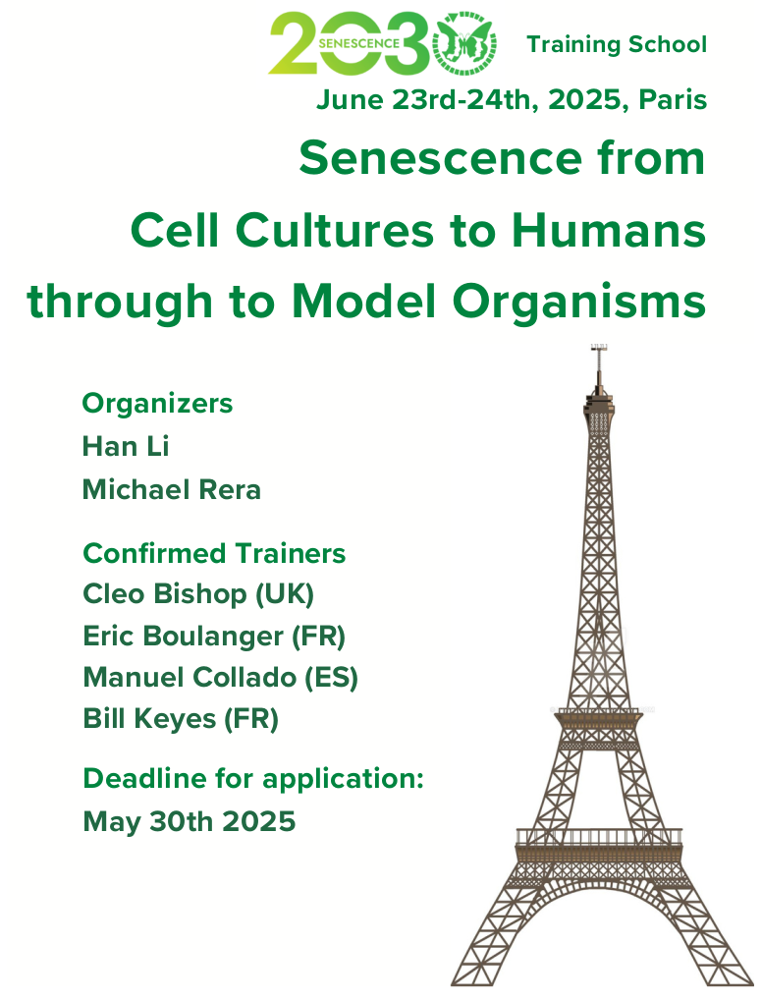
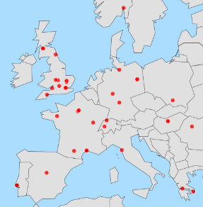
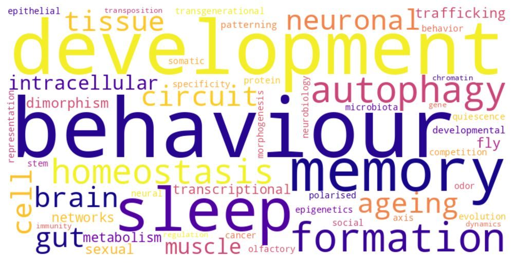

<h2 class="year">2025</h2>
 
<h2><li><b><a href="https://www.cost.eu/actions/CA23119/">COST Action SENESCENCE 2030</a> Training School, June 23-24 "Senescence from cell cultures to humans through model organisms" co-organised with<a href = "https://research.pasteur.fr/fr/member/han-li/"> Dr. Han Li</a> (Pasteur Institute).</b> Submit your provisional project <a href = "https://forms.gle/4LiWYZNNzJLLoqV59">here</a>.</li></h2>

<h2><li><b>JEDI 2025 meeting <a href="https://flies-jedi.github.io/projects/2025JEDImeeting/"> on June 3-5</a></b></li></h2>

<figure>
    
    <figcaption>Participants map</figcaption>
</figure>

<figure>
    
    <figcaption>Research themes</figcaption>
</figure>

