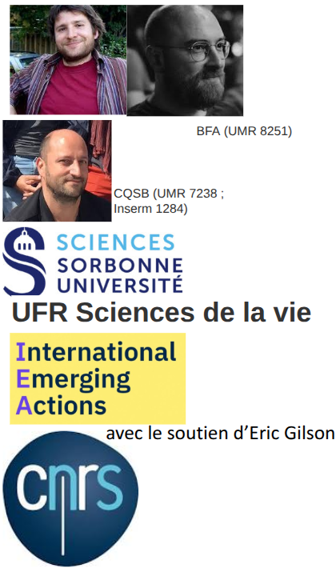
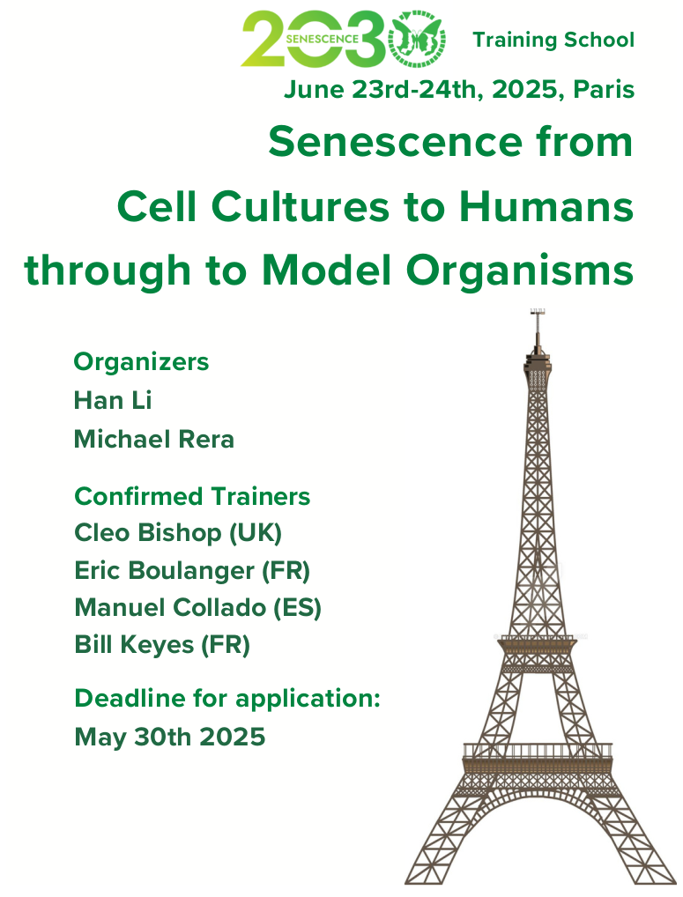
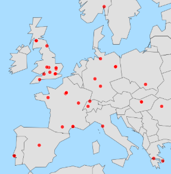
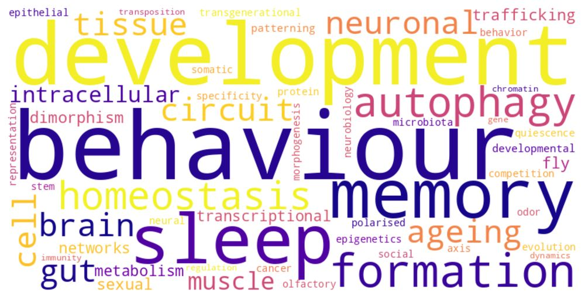

<h2 class="year">2026</h2>
 
<h2><li><b>5th colloquium "Expanding evolutionary theories of ageing to take into account symbioses and interactions throughout the Web of Life"</a></b> co-organised with <a href = "https://scholar.google.com/citations?user=aAnp-xkAAAAJ&hl=fr"> Dr. Eric Bapteste</a> and <a href = "https://scholar.google.com/citations?user=UVCppEoAAAAJ&hl=fr">Prof. Philippe Lopez</a>. </li></h2>

<b>November 4th 2026, Jussieu campus (Sorbonne Université, Paris).</b> Free, hybrid (in person — 40 seats, first come, first served — or online); registration required by email to <a href="mailto:epbapteste@gmail.com">epbapteste@gmail.com</a> before October 25th, stating whether you will attend in person or online.

  
  

  <b>Scientific program for the day</b>
  <ul>
    <li><b>9:00–9:05</b> – <b>Dr. Eric Bapteste</b> (SU, CNRS, Paris, France): ‘A few welcome words’</li>
    <li><b>9:05–9:30</b> – <b>Dr. Annette Baudisch</b> (University of Southern Denmark, Denmark): ‘The evolution of models of biodemography of aging: past, present, future’</li>
    <li><b>9:30–9:55</b> – <b>Pr. Emma Teeling</b> (University College Dublin, Dublin, Ireland): ‘The unexpected lessons from bat studies about aging’</li>
    <li><b>9:55–10:20</b> – <b>Pr. Suzanne Foitzick</b> (Institute of Molecular Biology gGmbH, Mainz, Germany): ‘Parasitism, symbioses and the manipulation of host aging’</li>
    <li><b>10:20–10:45</b> – <b>Dr. Katarzyna Siudeja</b> (I2BC, U. Paris-Saclay, France): ‘Endogeneous retroelements and aging’</li>
    <li><i>5-minute break</i></li>
    <li><b>10:45–11:10</b> – <b>Dr. Jane Reznick</b> (CECAD Excellence Cluster in Aging Research, University of Cologne, Germany): ‘Unexpected lessons of aging studies on naked mole rats’</li>
    <li><b>11:10–11:35</b> – <b>Pr. Vera Gorbunova</b> (University of Rochester, USA): ‘DNA repair, aging and longevity across the Tree of Life’</li>
    <li><b>11:35–12:00</b> – <b>Pr. Claudio Franceschi</b> (University of Bologna, Italy): ‘The social microbiome of older people’</li>
    <li><i>Lunch break</i></li>
    <li><b>14:15–14:40</b> – <b>Dr. Thomas Tully</b> (SU, Paris, France): ‘The shape and plasticity of ageing trajectories’</li>
    <li><b>14:40–15:05</b> – <b>Dr. Jean-François Lemaitre</b> (UMR CNRS 5558 – LBBE, UCB Lyon 1, France): ‘Male Reproductive Senescence in Mammals’</li>
    <li><b>15:05–15:30</b> – <b>Pr. Eric Gilson</b> (Université Côte d’Azur, Nice, France): ‘The molecular evolution of animal aging’</li>
    <li><b>15:30–15:55</b> – <b>Pr. Guido Kroemer</b> (Gustave Roussy, Grand-Paris, France): ‘A phylogenetically conserved pro-aging pathway involving ACBP/DBI’</li>
    <li><i>5-minute break</i></li>
    <li><b>15:55–16:20</b> – <b>Pr. Uri Alon</b> (Weizmann Institute, Israel): ‘Open issues in the aging of (biological) systems’</li>
    <li><b>16:20–16:45</b> – <b>Dr. Andreas Beyer</b> (CECAD Excellence Cluster in Aging Research, University of Cologne, Germany): ‘Systems biology and aging’</li>
    <li><b>16:45–17:10</b> – <b>Pr. Steve Horvath</b> (UCLA, USA): ‘Epigenetic clocks across the Tree of Life: limits and successes’</li>
    <li><b>17:10–17:35</b> – <b>Pr. Agustin Ibanez</b> (Senior Atlantic Fellow, Global Brain Health Institute (GBHI.org), UCSF San Francisco, US &amp; TCD Dublin, Ireland): ‘The exposome of healthy and accelerated aging across 40 countries’ (may be moved to the last talk of the day)</li>
    <li><b>17:35–18:00</b> – <b>Dr. Johannes Martens</b> (SU, Paris, France): ‘Aging and ontology’</li>
  </ul>
  

<h2 class="year">2025</h2>
 
<h2><li><b><a href="https://www.insb.cnrs.fr/fr/evenement/expanding-evolutionary-theories-ageing-take-account-symbioses-and-interactions-throughout">"Expanding evolutionary theories of ageing to take into account symbioses and interactions throughout the Web of Life"</a></b> co-organised with <a href = "https://scholar.google.com/citations?user=aAnp-xkAAAAJ&hl=fr"> Dr. Eric Bapteste</a> and <a href = "https://scholar.google.com/citations?user=UVCppEoAAAAJ&hl=fr">Prof. Philippe Lopez</a>. </li></h2>

<h2><li><b><a href="https://www.cost.eu/actions/CA23119/">COST Action SENESCENCE 2030</a> Training School, June 23-24 "Senescence from cell cultures to humans through model organisms" co-organised with<a href = "https://research.pasteur.fr/fr/member/han-li/"> Dr. Han Li</a> (Pasteur Institute).</b> Submit your provisional project <a href = "https://forms.gle/4LiWYZNNzJLLoqV59">here</a>.</li></h2>

<h2><li><b>JEDI 2025 meeting <a href="https://flies-jedi.github.io/projects/2025JEDImeeting/"> on June 3-5</a></b></li></h2>

  <figure>
    
    <figcaption>Participants map</figcaption>
  </figure>

  <figure>
    
    <figcaption>Research themes</figcaption>
  </figure>

